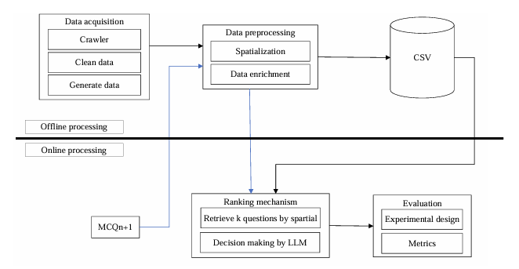

# Checking_duplicate_question_in_question_bank
This is a way for detecting similar or duplicate multiple-choice questions using a large language model (LLM) integrated with domain-specific knowledge derived from the syllabus, learning outcomes, and learning materials. The method involves spatializing questions based on their knowledge location within the learning materials and a two-step ranking mechanism combining spatial-based retrieval with LLM-powered decision-making enhanced by prompt engineering techniques. 

Our approach considers two key aspects: learning outcomes (Los) and learning materials (LMs). The system includes data acquisition and preprocessing, ranking mechanisms, prompt engineering, and evaluation methods. It allows querying to find similar questions based on similarity ranking.


## Quick start

```bash
# Get the code
git clone https://github.com/quynam2205/Checking_duplicate_question_in_question_bank.git

# Get in the folder
cd Checking_duplicate_question_in_question_bank
```

To run the app, you can run file "app.py" or run this in ternimal:
```bash
# Run app
python app.py
```

#### !Note: To run this, you have to use Gemini api. Change it in "python_algo/config.py" before you run.
## Methodology
- We propose an approach that combines the LLM model to check the similarity of a question with the questions that already existed in the previous question bank. The proposed method includes the following main steps: Data acquisition, Data preprocessing, Ranking mechanism, Evaluation.


- The Ranking mechanism focuses on retrieving duplicated questions to the input question 𝑞𝑛+1. This process includes two main steps including related questions retrieval and decision-making module.


## Demo


